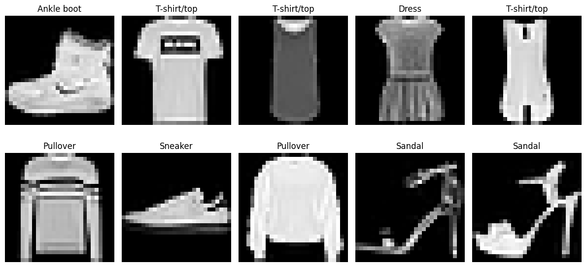

# 👕 Fashion Police Division
## FashionMNIST Image Classification Using Convolutional Neural Networks (CNNs)

> Building a Computer Vision system that classifies fashion products using Deep Learning and PyTorch.


---

## Project Highlights

✅ Built Convolutional Neural Networks (CNNs) from scratch using PyTorch

✅ Performed evidence-based Exploratory Data Analysis (EDA)

✅ Experimented with multiple CNN architectures

✅ Applied hypothesis-driven experimentation

✅ Conducted Confusion Matrix Analysis

✅ Tested predictions on unseen images

✅ Achieved a final **90.11% Test Accuracy**

✅ Documented the complete Deep Learning workflow from data exploration to model evaluation

---

## Final Result

| Metric | Value |
|----------|----------|
| CNN Version 1 Accuracy | 89.36% |
| CNN Version 2 Accuracy | 90.11% |
| Best Model | CNN Version 2 |
| Dataset | FashionMNIST |
| Framework | PyTorch |

---

# Project Story

A few days ago, Convolutional Neural Networks (CNNs) felt intimidating.

Terms like convolution, feature maps, pooling, kernels, and channels sounded complex and difficult to visualize. I could memorize the definitions, but I didn't truly understand how the pieces worked together.

Instead of trying to memorize concepts, I decided to approach CNNs differently.

I treated the learning process like an investigation.

Each layer had a role:

- Convolution layers became detectives gathering evidence.
- ReLU became the process of filtering weak clues.
- Max Pooling became evidence compression.
- Flatten prepared the case file.
- Linear layers became the judges delivering the final verdict.

This project became more than a model-building exercise.

It became an opportunity to understand how CNNs learn visual patterns, how architectural decisions affect performance, and how evidence—not assumptions—should guide machine learning decisions.

Along the way, I built multiple CNN architectures, evaluated their performance, investigated misclassifications, and tested hypotheses about model behavior.

The most valuable lesson was not achieving **90.11% test accuracy**.

It was learning how to think like a Machine Learning Engineer:

✅ Build

✅ Evaluate

✅ Investigate

✅ Form hypotheses

✅ Test assumptions

✅ Let evidence drive conclusions

This repository documents that journey.

---

# Business Understanding

Image classification is one of the most widely used Computer Vision applications and plays an important role across industries.

Examples include:

- E-commerce product categorization
- Inventory management
- Visual search systems
- Recommendation engines
- Automated content tagging

The ability to automatically identify products from images can improve efficiency, reduce manual effort, and enhance customer experiences.

---

## Project Objective

The objective of this project was to build a Convolutional Neural Network (CNN) capable of accurately classifying fashion products into one of ten categories using image data from the FashionMNIST dataset.

Beyond achieving strong predictive performance, this project focused on:

- Understanding CNN fundamentals
- Investigating how CNNs learn visual features
- Evaluating different CNN architectures
- Applying hypothesis-driven experimentation
- Using evidence-based analysis to interpret model performance

---

## Success Criteria

A successful outcome required:

✅ Accurate classification of unseen fashion images

✅ Evaluation using both accuracy and confusion matrices

✅ Demonstration of CNN feature learning

✅ Evidence-based performance improvement through experimentation

✅ Documentation of findings and lessons learned

---

# Dataset Overview

## Dataset

This project uses the **FashionMNIST** dataset, a benchmark Computer Vision dataset designed for image classification tasks.

FashionMNIST was created as a more challenging alternative to the traditional MNIST handwritten digits dataset and contains grayscale images of clothing items across multiple categories.

---

## Dataset Characteristics

| Feature | Value |
|----------|---------|
| Total Images | 70,000 |
| Training Images | 60,000 |
| Test Images | 10,000 |
| Image Size | 28 × 28 Pixels |
| Image Type | Grayscale |
| Number of Classes | 10 |

---

## Classes

| Label | Category |
|---------|-----------|
| 0 | T-shirt/top |
| 1 | Trouser |
| 2 | Pullover |
| 3 | Dress |
| 4 | Coat |
| 5 | Sandal |
| 6 | Shirt |
| 7 | Sneaker |
| 8 | Bag |
| 9 | Ankle Boot |

---

## Dataset Exploration Highlights

During Exploratory Data Analysis (EDA), the following observations were verified:

✅ Training dataset contains **60,000 images**

✅ Test dataset contains **10,000 images**

✅ All images have dimensions of **28 × 28 pixels**

✅ The dataset is perfectly balanced, with **6,000 training samples per class**

✅ Images are standardized and centered, making them suitable for CNN-based image classification

---

## Why FashionMNIST?

FashionMNIST provides an excellent introduction to Computer Vision because it contains real-world image patterns while remaining computationally lightweight.

The dataset allows experimentation with:

- Image Classification
- Feature Extraction
- Convolutional Neural Networks (CNNs)
- Model Evaluation
- Deep Learning Workflows

It also provides a practical environment for understanding how CNNs distinguish between visually similar objects.
`
---

# Exploratory Data Analysis (EDA)

Before building the CNN, the dataset was explored to better understand its structure and characteristics.

The goal of this analysis was to investigate:

- Dataset dimensions
- Class distribution
- Image characteristics
- Potential classification challenges

---

## Dataset Verification

Exploration confirmed:

- Training Dataset Shape: **60,000 × 28 × 28**
- Test Dataset Shape: **10,000 × 28 × 28**

This confirms that every image is standardized to a resolution of **28 × 28 pixels**, making the dataset suitable for CNN-based image classification.

---

## Class Distribution Analysis

Class distribution analysis revealed:

```text
6,000 images per class
```

for all ten categories.

This confirms that the FashionMNIST training dataset is perfectly balanced and provides equal representation for each clothing category.

---

## Sample Images

The following sample images were inspected during the EDA process:


---

## Visual Inspection Findings

Inspection of sample images revealed:

✅ Images are grayscale

✅ Images are centered and standardized

✅ Footwear categories exhibit distinctive silhouettes

✅ Bags possess strong visual uniqueness

✅ Several upper-body clothing categories appear visually related and may present greater classification challenges

---

## EDA Summary

Key findings from the exploratory analysis include:

- Images are standardized and suitable for CNN processing.
- Dataset classes are perfectly balanced.
- Certain categories appear visually easier to distinguish than others.
- The dataset provides a strong environment for learning Computer Vision and Deep Learning workflows.

These observations were later validated through model evaluation and confusion matrix analysis.

---

# 🏗️ CNN Architecture & Experimental Design

To investigate how Convolutional Neural Networks (CNNs) learn visual features, two CNN architectures were developed and evaluated.

The objective was to establish a baseline model and then determine whether a deeper architecture could improve performance.

---

## CNN Version 1 (Baseline Model)

The first architecture was intentionally simple and served as a baseline for performance comparison.

### Architecture

```text
Input Image
      ↓
Conv2D (1 → 32)
      ↓
ReLU
      ↓
MaxPool
      ↓
Flatten
      ↓
Linear
      ↓
Prediction
```

### Performance

```text
Test Accuracy: 89.36%
```

The baseline model demonstrated that even a relatively simple CNN architecture could effectively classify FashionMNIST images.

---

## CNN Version 2 (Improved Model)

To investigate whether a deeper architecture could improve classification performance, a second convolutional layer was introduced.

### Architecture

```text
Input Image
      ↓
Conv2D (1 → 32)
      ↓
ReLU
      ↓
MaxPool

      ↓

Conv2D (32 → 64)
      ↓
ReLU
      ↓
MaxPool

      ↓

Flatten
      ↓
Linear
      ↓
Prediction
```

The second convolution layer allows the model to learn more complex visual patterns from features extracted by the first layer.

---

## Detective Interpretation 🕵🏽‍♀️

Throughout this project, the CNN architecture was understood using the following learning analogy:

```text
Conv2D
↓
Detectives gather evidence

ReLU
↓
Ignore weak clues

MaxPool
↓
Compress evidence

Flatten
↓
Prepare the case file

Linear
↓
Judges deliver the verdict
```

This analogy helped simplify the learning process and build intuition around how information flows through a CNN.

---

# Experiments & Hypothesis Testing

A key objective of this project was not only to build a CNN, but also to understand how architectural changes affect model performance.

To achieve this, two CNN architectures were evaluated and compared.

---

## Experiment 1: Baseline CNN

The first model used a single convolutional layer and was trained for 5 epochs.

### Result

| Model | Accuracy |
|----------|----------|
| CNN Version 1 | 89.36% |

The baseline architecture achieved strong performance and established a benchmark for future experiments.

---

## Experiment 2: Deeper CNN

A second convolutional layer was introduced to allow the network to learn more complex visual patterns.

The upgraded model was trained for 10 epochs.

### Result

| Model | Accuracy |
|----------|----------|
| CNN Version 2 | 90.11% |

The deeper architecture achieved the highest overall performance.

---

## Performance Comparison

| Model | Accuracy |
|----------|----------|
| CNN Version 1 | 89.36% |
| CNN Version 2 | 90.11% |

### Improvement

```text
+0.75%
```

Although the performance improvement was modest, the experiment demonstrated that a deeper CNN combined with sufficient training can improve classification performance.

---

## Key Lesson

This experiment reinforced an important Machine Learning principle:

> More complex models do not automatically perform better.
>
> Model improvements should be validated through experimentation and evidence rather than assumptions.

---
# Results & Model Evaluation

Model performance was evaluated using test accuracy, confusion matrix analysis, and individual prediction testing.

---

## Final Performance Summary

| Model | Accuracy |
|----------|----------|
| CNN Version 1 | 89.36% |
| CNN Version 2 | 90.11% |

### Best Performing Model

 **CNN Version 2**

The deeper CNN architecture achieved the highest test accuracy after sufficient training.

---

## Key Outcome

The final model successfully classified FashionMNIST images with a test accuracy of:

```text
90.11%
```

This demonstrates that CNNs can effectively learn visual patterns and distinguish between fashion product categories.

---
# Confusion Matrix Insights

A confusion matrix was generated to identify which clothing categories were classified successfully and which categories remained challenging.

---

## Strongly Classified Categories

The model performed particularly well on:

✅ Trouser

✅ Sandal

✅ Sneaker

✅ Bag

✅ Ankle Boot

These categories possess distinctive visual characteristics that make them easier for the CNN to distinguish.

---

## Most Frequently Confused Categories

The model experienced the greatest difficulty with:

⚠️ T-shirt/top

⚠️ Shirt

⚠️ Pullover

⚠️ Coat

These categories share similar visual structures and were occasionally misclassified.

---

## Key Insight

Although the model achieved more than 90% accuracy, confusion matrix analysis revealed that performance was not uniform across all categories.

Visually distinct categories were classified with high accuracy, while several upper-body clothing items remained more challenging.

This demonstrates why confusion matrix analysis provides deeper insight than accuracy alone.

---

# Prediction Lab

Beyond aggregate evaluation metrics, the model was tested on individual unseen images from the test dataset.

This provides a practical demonstration of the CNN's ability to generalize beyond the training data.

---

## Sample Prediction

| Actual Label | Predicted Label |
|-------------|----------------|
| Ankle Boot 👢 | Ankle Boot 👢 |

✅ Correct Classification

The model successfully identified the test image and produced the correct prediction.

This demonstrates the model's ability to perform image classification on previously unseen fashion items.

---

## Why Prediction Testing Matters

Accuracy scores and confusion matrices provide high-level performance indicators.

Prediction testing allows direct inspection of model behavior on individual examples and helps confirm that the model performs as expected in real-world scenarios.

---

# Key Learnings

This project reinforced several important Deep Learning and Machine Learning concepts.

### Technical Learnings

- CNNs learn image features hierarchically, progressing from simple edges to complex visual patterns.
- More layers do not automatically improve performance.
- Additional model complexity often requires additional training time.
- Confusion matrices reveal insights that overall accuracy alone cannot provide.

### Machine Learning Learnings

- Model improvements should be validated through experimentation rather than assumptions.
- Hypothesis-driven experimentation is a valuable problem-solving approach.
- Model evaluation requires more than a single performance metric.
- Evidence should guide conclusions and future improvements.

### Most Important Lesson

The most valuable lesson from this project was learning to investigate model behavior rather than focusing only on final accuracy scores.

Understanding *why* a model behaves the way it does is just as important as achieving strong performance.

---
# Future Improvements

While the final CNN achieved strong performance, several opportunities exist for further improvement.

### Model Architecture

- Experiment with deeper CNN architectures
- Increase the number of convolutional layers
- Explore different kernel sizes

### Training Optimization

- Increase training duration
- Tune learning rates
- Experiment with different batch sizes

### Regularization Techniques

- Dropout
- Batch Normalization

These techniques may improve generalization and reduce overfitting.

### Data Enhancement

- Data Augmentation
- Random rotations
- Horizontal flips
- Image transformations

### Advanced Computer Vision Approaches

Future experimentation could include:

- Transfer Learning
- ResNet Architectures
- Pre-trained Computer Vision Models

These approaches may further improve classification performance.

---
# Tech Stack

### Programming Language

- Python

### Deep Learning Framework

- PyTorch

### Data Processing

- Torchvision
- NumPy

### Visualization

- Matplotlib
- Seaborn

### Model Evaluation

- Scikit-Learn

### Development Environment

- Google Colab

---

# Repository Structure

```text
fashion-police-division/
│
├── notebook/
│   └── FashionMNIST_CNN.ipynb
│
├── images/
│   ├── sample_fashionmnist.png
│   ├── confusion_matrix.png
│   └── sample_prediction.png
│
├── README.md
│
└── requirements.txt
```
# Author

## Perpetua Okoloekwe

Data Scientist | AI Engineering Journey | Building in Public

Passionate about applying Machine Learning and AI to solve real-world problems through experimentation, analysis, and evidence-based decision making.

### Connect With Me

- LinkedIn: [*https://www.linkedin.com/in/perpetua-okoloekwe/](https://www.linkedin.com/in/perpetua-okoloekwe/)
- GitHub: [(https://github.com/perpetua-okoloekwe)](https://github.com/perpetua-okoloekwe)](https://github.com/perpetua-okoloekwe)
- Portfolio:[https://sites.google.com/view/perpetua-okoloekwe/home)](https://sites.google.com/view/perpetua-okoloekwe/home)

---

🌱 One day at a time.


